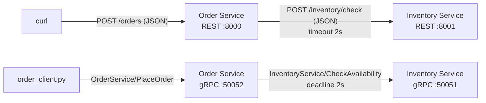

# REST vs gRPC: Order → Inventory

The same two-service interaction is built twice in Python, once over **REST/HTTP + JSON** and once over **gRPC + Protocol Buffers**:

- **Order Service** accepts an order (`item_id`, `quantity`) and asks the Inventory Service whether it can be filled.
- **Inventory Service** checks whether the item exists and has enough units in stock.



Both Inventory services read the same stock from [`data/inventory.json`](data/inventory.json):

| item_id | laptop | keyboard | monitor | headphones |
|---|---|---|---|---|
| in stock | 10 | 25 | 3 | 0 |

## Repository layout

```
proto/
  inventory.proto          InventoryService contract (CheckAvailability)
  order.proto              OrderService contract (PlaceOrder, Health)
rest_version/
  inventory_service.py     Flask, POST /inventory/check            :8001
  order_service.py         Flask, POST /orders, GET /health         :8000
grpc_version/
  inventory_server.py      gRPC InventoryService                    :50051
  order_server.py          gRPC OrderService                        :50052
  order_client.py          command-line gRPC client (the gRPC "curl")
  *_pb2.py, *_pb2_grpc.py  code generated from proto/
data/inventory.json        stock shared by both versions
scripts/demo.sh            runs the whole demo for one version and saves evidence/
evidence/rest, evidence/grpc   client output and service logs from the runs shown below
```

## Contract and status codes

| Situation | REST Inventory | REST Order | gRPC Inventory | gRPC Order |
|---|---|---|---|---|
| Item in stock | `200 OK` | `201 Created` | `OK` | `OK` (status `CONFIRMED`) |
| Bad input (quantity < 1, missing or wrong-type field) | `400 Bad Request` | `400 Bad Request` | `INVALID_ARGUMENT` | `INVALID_ARGUMENT` |
| Unknown item | `404 Not Found` | `404 Not Found` | `NOT_FOUND` | `NOT_FOUND` |
| Not enough stock | `409 Conflict` | `409 Conflict` | `FAILED_PRECONDITION` | `FAILED_PRECONDITION` |
| Inventory slower than the timeout / deadline | – | `504 Gateway Timeout` | stops work when the deadline expires | `DEADLINE_EXCEEDED` |
| Inventory not reachable | – | `503 Service Unavailable` | – | `UNAVAILABLE` |

Not enough stock maps to `409 Conflict` and `FAILED_PRECONDITION` because the request is valid but the current state of the inventory can't satisfy it. `RESOURCE_EXHAUSTED` is meant for quotas and rate limits, so it isn't used here. The Order → Inventory call has a **2 second** limit in both versions (`--timeout` for REST, `--deadline` for gRPC).

## Setup (once)

Requires Python 3.10+. The evidence below was produced with Python 3.13.15 on Windows 11.

```bash
# macOS / Linux / Git Bash
python -m venv .venv
source .venv/bin/activate        # Git Bash on Windows: source .venv/Scripts/activate
pip install -r requirements.txt
```

```powershell
# Windows PowerShell
python -m venv .venv
.venv\Scripts\Activate.ps1       # if blocked: Set-ExecutionPolicy -Scope Process Bypass
pip install -r requirements.txt
```

Run every command below from the repository root, with the virtual environment active.

The generated gRPC code is committed, so you don't need to regenerate it. After changing a `.proto` file, regenerate it with:

```bash
python -m grpc_tools.protoc -I proto --python_out=grpc_version --grpc_python_out=grpc_version proto/inventory.proto proto/order.proto
```

## Running the REST version

```bash
# Terminal 1 - Inventory Service (REST) on :8001
python rest_version/inventory_service.py

# Terminal 2 - Order Service (REST) on :8000, 2 s timeout on the call to Inventory
python rest_version/order_service.py --timeout 2

# Terminal 3 - client
curl -i -X POST http://127.0.0.1:8000/orders -H "Content-Type: application/json" -d '{"item_id": "laptop", "quantity": 2}'
curl -i http://127.0.0.1:8000/health
```

> **PowerShell:** Windows PowerShell 5.1 strips the inner quotes from `-d '{...}'`, so pipe the body in instead:
> `'{"item_id": "laptop", "quantity": 2}' | curl.exe -i -X POST http://127.0.0.1:8000/orders -H "Content-Type: application/json" --data-binary '@-'`

**Timeout demo (REST):**

1. In Terminal 1, press `Ctrl+C`, then restart Inventory with a 5 s delay, which is longer than the 2 s timeout:
   `python rest_version/inventory_service.py --delay 5`
2. In Terminal 3, send the order again. After about 2 s it returns **`504 Gateway Timeout`**.
3. `curl -i http://127.0.0.1:8000/health` still returns `200` with the **same pid**: the Order Service never stopped.
4. In Terminal 1, press `Ctrl+C` and start Inventory without `--delay`. The next order returns `201 Created` from the same Order Service process.

## Running the gRPC version

```bash
# Terminal 1 - Inventory Service (gRPC) on :50051
python grpc_version/inventory_server.py

# Terminal 2 - Order Service (gRPC) on :50052, 2 s deadline on the call to Inventory
python grpc_version/order_server.py --deadline 2

# Terminal 3 - client
python grpc_version/order_client.py laptop 2
python grpc_version/order_client.py --health
```

**Deadline demo (gRPC):**

1. In Terminal 1, press `Ctrl+C`, then restart Inventory with a 5 s delay, which is longer than the 2 s deadline:
   `python grpc_version/inventory_server.py --delay 5`
2. `python grpc_version/order_client.py laptop 1` returns **`DEADLINE_EXCEEDED`** after about 2 s.
3. `python grpc_version/order_client.py --health` still returns `OK` with the **same pid**.
4. In Terminal 1, press `Ctrl+C` and start Inventory without `--delay`. The next order is `CONFIRMED` by the same Order Service process.

### One-command demo

`scripts/demo.sh` runs all of the steps above for one version. It starts both services, sends the requests, restarts Inventory with `--delay 5` and then without it, and saves every client output and service log to `evidence/<version>/`. It runs in Git Bash on Windows and in bash on macOS/Linux:

```bash
bash scripts/demo.sh rest
bash scripts/demo.sh grpc
```

---

## Evidence

All output below is unedited. It comes from `bash scripts/demo.sh rest` and `bash scripts/demo.sh grpc`, and the complete files are in [`evidence/`](evidence). Service logs show local time (PDT). The HTTP `Date` header is in GMT, which is 7 hours ahead.

### 1. Successful REST request and response

Client ([`evidence/rest/client_1_normal.txt`](evidence/rest/client_1_normal.txt)):

```
$ curl -s -i -X POST http://127.0.0.1:8000/orders -H "Content-Type: application/json" -d '{"item_id": "laptop", "quantity": 2}'
HTTP/1.1 201 CREATED
Server: Werkzeug/3.1.9 Python/3.13.15
Date: Sun, 04 Oct 2026 23:24:45 GMT
Content-Type: application/json
Content-Length: 77
Connection: close

{"order_id":"ORD-0001","status":"CONFIRMED","item_id":"laptop","quantity":2}
```

The Order → Inventory REST call on its own:

```
$ curl -s -i -X POST http://127.0.0.1:8001/inventory/check -H "Content-Type: application/json" -d '{"item_id": "laptop", "quantity": 2}'
HTTP/1.1 200 OK
Server: Werkzeug/3.1.9 Python/3.13.15
Date: Sun, 04 Oct 2026 23:24:45 GMT
Content-Type: application/json
Content-Length: 85
Connection: close

{"item_id":"laptop","requested_quantity":2,"available_quantity":10,"available":true}
```

Order Service log ([`evidence/rest/order_service.log`](evidence/rest/order_service.log)):

```
16:24:45.044 INFO    order-rest | POST /orders item_id=laptop quantity=2 -> POST http://127.0.0.1:8001/inventory/check (timeout 2.0s)
16:24:45.048 INFO    order-rest | Inventory 200 OK in 4 ms -> 201 Created ORD-0001
```

<details>
<summary>REST error cases: 409, 404, 400</summary>

```
$ curl -s -i -X POST http://127.0.0.1:8000/orders -H "Content-Type: application/json" -d '{"item_id": "monitor", "quantity": 5}'
HTTP/1.1 409 CONFLICT
Server: Werkzeug/3.1.9 Python/3.13.15
Date: Sun, 04 Oct 2026 23:24:45 GMT
Content-Type: application/json
Content-Length: 93
Connection: close

{"error":"INSUFFICIENT_STOCK","message":"Only 3 unit(s) of 'monitor' in stock, 5 requested"}

$ curl -s -i -X POST http://127.0.0.1:8000/orders -H "Content-Type: application/json" -d '{"item_id": "phone", "quantity": 1}'
HTTP/1.1 404 NOT FOUND
Server: Werkzeug/3.1.9 Python/3.13.15
Date: Sun, 04 Oct 2026 23:24:45 GMT
Content-Type: application/json
Content-Length: 67
Connection: close

{"error":"ITEM_NOT_FOUND","message":"Item 'phone' does not exist"}

$ curl -s -i -X POST http://127.0.0.1:8000/orders -H "Content-Type: application/json" -d '{"item_id": "laptop", "quantity": 0}'
HTTP/1.1 400 BAD REQUEST
Server: Werkzeug/3.1.9 Python/3.13.15
Date: Sun, 04 Oct 2026 23:24:45 GMT
Content-Type: application/json
Content-Length: 74
Connection: close

{"error":"INVALID_ARGUMENT","message":"quantity must be an integer >= 1"}
```

</details>

### 2. Successful gRPC request and response

Client ([`evidence/grpc/client_1_normal.txt`](evidence/grpc/client_1_normal.txt)). Messages are printed in protobuf text format:

```
$ python grpc_version/order_client.py laptop 2
> order.v1.OrderService/PlaceOrder  target=127.0.0.1:50052  deadline=10s
  item_id: "laptop"
  quantity: 2
< OK  (4 ms)
  order_id: "ORD-0001"
  status: "CONFIRMED"
  item_id: "laptop"
  quantity: 2
```

The Order → Inventory gRPC call, as seen in both service logs:

```
# evidence/grpc/order_service.log
16:25:03.529 INFO    order-grpc | PlaceOrder item_id=laptop quantity=2 -> InventoryService.CheckAvailability @ 127.0.0.1:50051 (deadline 2.0s)
16:25:03.531 INFO    order-grpc | Inventory OK in 2 ms -> CONFIRMED ORD-0001

# evidence/grpc/inventory_1_normal.log
16:25:03.531 INFO    inventory-grpc | CheckAvailability item_id=laptop quantity=2 (caller deadline in 2.01s)
16:25:03.531 INFO    inventory-grpc | -> OK available_quantity=10 (after 0.00s)
```

When the item is unavailable, the gRPC call fails with a status code instead of returning a reply:

```
$ python grpc_version/order_client.py monitor 5
> order.v1.OrderService/PlaceOrder  target=127.0.0.1:50052  deadline=10s
  item_id: "monitor"
  quantity: 5
< FAILED_PRECONDITION  (8 ms)
  details: Only 3 unit(s) of 'monitor' in stock, 5 requested

$ python grpc_version/order_client.py phone 1
> order.v1.OrderService/PlaceOrder  target=127.0.0.1:50052  deadline=10s
  item_id: "phone"
  quantity: 1
< NOT_FOUND  (4 ms)
  details: Item 'phone' does not exist

$ python grpc_version/order_client.py laptop 0
> order.v1.OrderService/PlaceOrder  target=127.0.0.1:50052  deadline=10s
  item_id: "laptop"
< INVALID_ARGUMENT  (2 ms)
  details: quantity must be an integer >= 1
```

### 3. REST timeout handling

Inventory was restarted with `--delay 5`, and the Order Service was left running with `--timeout 2`.

Client ([`evidence/rest/client_2_slow_inventory.txt`](evidence/rest/client_2_slow_inventory.txt)). The order fails cleanly with `504` after 2.03 s, not 5 s:

```
$ curl -s -i -w '\ntime_total=%{time_total}s\n' -X POST http://127.0.0.1:8000/orders -H "Content-Type: application/json" -d '{"item_id": "laptop", "quantity": 1}'
HTTP/1.1 504 GATEWAY TIMEOUT
Server: Werkzeug/3.1.9 Python/3.13.15
Date: Sun, 04 Oct 2026 23:24:51 GMT
Content-Type: application/json
Content-Length: 88
Connection: close

{"error":"INVENTORY_TIMEOUT","message":"Inventory service did not respond within 2.0s"}

time_total=2.034291s
```

Order Service log. `requests` raised `Timeout`, which was caught and turned into a 504:

```
16:24:49.008 INFO    order-rest | POST /orders item_id=laptop quantity=1 -> POST http://127.0.0.1:8001/inventory/check (timeout 2.0s)
16:24:51.040 ERROR   order-rest | Inventory timed out after 2.03s -> 504 Gateway Timeout
```

Inventory log ([`evidence/rest/inventory_2_delay.log`](evidence/rest/inventory_2_delay.log)). The REST Inventory doesn't know the caller gave up, so it finishes the full 5 s and sends a `200` that nobody reads:

```
16:24:49.027 INFO    inventory-rest | POST /inventory/check item_id=laptop quantity=1
16:24:49.027 WARNING inventory-rest | simulated slow response: sleeping 5.0s
16:24:54.028 INFO    inventory-rest | -> 200 OK available_quantity=10 (after 5.00s)
```

### 4. gRPC deadline handling

Inventory was restarted with `--delay 5`, and the Order Service was left running with `--deadline 2`.

Client ([`evidence/grpc/client_2_slow_inventory.txt`](evidence/grpc/client_2_slow_inventory.txt)):

```
$ python grpc_version/order_client.py laptop 1
> order.v1.OrderService/PlaceOrder  target=127.0.0.1:50052  deadline=10s
  item_id: "laptop"
  quantity: 1
< DEADLINE_EXCEEDED  (2011 ms)
  details: Inventory service did not respond within the 2.0s deadline
```

Order Service log. The stub raised `grpc.RpcError` with code `DEADLINE_EXCEEDED`, which was caught and returned to the client as a status:

```
16:25:08.012 INFO    order-grpc | PlaceOrder item_id=laptop quantity=1 -> InventoryService.CheckAvailability @ 127.0.0.1:50051 (deadline 2.0s)
16:25:10.020 ERROR   order-grpc | Inventory exceeded the 2.0s deadline (gave up after 2.01s) -> DEADLINE_EXCEEDED
```

Inventory log ([`evidence/grpc/inventory_2_delay.log`](evidence/grpc/inventory_2_delay.log)). The deadline travels with the gRPC request, so the server knows it, sees it expire, and stops work at 2 s instead of 5 s:

```
16:25:08.014 INFO    inventory-grpc | CheckAvailability item_id=laptop quantity=1 (caller deadline in 2.01s)
16:25:08.014 WARNING inventory-grpc | simulated slow response: sleeping 5.0s
16:25:10.032 WARNING inventory-grpc | caller's deadline expired after 2.02s -> abandoning this request
```

### 5. The Order Service keeps running after the failures

Neither Order Service was restarted at any point. Right after the failure, the health check answers with the same pid, and `inventory_errors` counts the failure. Once Inventory is back without the delay, the **same process** confirms the next order (`ORD-0002`).

**REST**, pid `22688` throughout ([`client_2_slow_inventory.txt`](evidence/rest/client_2_slow_inventory.txt), [`client_3_recovered.txt`](evidence/rest/client_3_recovered.txt)):

```
$ curl -s -i http://127.0.0.1:8000/health          # right after the 504
HTTP/1.1 200 OK
...
{"status":"UP","pid":22688,"uptime_seconds":6.7,"orders_confirmed":1,"orders_rejected":2,"inventory_errors":1}

$ curl -s -i -X POST http://127.0.0.1:8000/orders -H "Content-Type: application/json" -d '{"item_id": "laptop", "quantity": 1}'
HTTP/1.1 201 CREATED
...
{"order_id":"ORD-0002","status":"CONFIRMED","item_id":"laptop","quantity":1}

$ curl -s -i http://127.0.0.1:8000/health
HTTP/1.1 200 OK
...
{"status":"UP","pid":22688,"uptime_seconds":13.0,"orders_confirmed":2,"orders_rejected":2,"inventory_errors":1}
```

**gRPC**, pid `17952` throughout ([`client_2_slow_inventory.txt`](evidence/grpc/client_2_slow_inventory.txt), [`client_3_recovered.txt`](evidence/grpc/client_3_recovered.txt)):

```
$ python grpc_version/order_client.py --health     # right after DEADLINE_EXCEEDED
> order.v1.OrderService/Health  target=127.0.0.1:50052  deadline=10s
  (empty message)
< OK  (2 ms)
  status: "UP"
  pid: 17952
  uptime_seconds: 7.5
  orders_confirmed: 1
  orders_rejected: 2
  inventory_errors: 1

$ python grpc_version/order_client.py laptop 1
> order.v1.OrderService/PlaceOrder  target=127.0.0.1:50052  deadline=10s
  item_id: "laptop"
  quantity: 1
< OK  (4 ms)
  order_id: "ORD-0002"
  status: "CONFIRMED"
  item_id: "laptop"
  quantity: 1

$ python grpc_version/order_client.py --health
> order.v1.OrderService/Health  target=127.0.0.1:50052  deadline=10s
  (empty message)
< OK  (2 ms)
  status: "UP"
  pid: 17952
  uptime_seconds: 11.2
  orders_confirmed: 2
  orders_rejected: 2
  inventory_errors: 1
```

Both Order Service logs continue straight from the failure to the next successful order:

```
# evidence/rest/order_service.log
16:24:51.040 ERROR   order-rest | Inventory timed out after 2.03s -> 504 Gateway Timeout
16:24:57.356 INFO    order-rest | POST /orders item_id=laptop quantity=1 -> POST http://127.0.0.1:8001/inventory/check (timeout 2.0s)
16:24:57.377 INFO    order-rest | Inventory 200 OK in 21 ms -> 201 Created ORD-0002

# evidence/grpc/order_service.log
16:25:10.020 ERROR   order-grpc | Inventory exceeded the 2.0s deadline (gave up after 2.01s) -> DEADLINE_EXCEEDED
16:25:13.720 INFO    order-grpc | PlaceOrder item_id=laptop quantity=1 -> InventoryService.CheckAvailability @ 127.0.0.1:50051 (deadline 2.0s)
16:25:13.722 INFO    order-grpc | Inventory OK in 2 ms -> CONFIRMED ORD-0002
```

---

## REST vs gRPC: what I observed

With gRPC the contract lives in one place, because `inventory.proto` defines the messages, field types, and RPC and both stubs are generated from it, whereas in REST it is spread across the URL, the JSON field names, and the status codes, so both REST services had to check every field by hand (a missing field, `"2"` instead of `2`, or `true` passed as a number). The proto types still don't catch everything: proto3 cannot tell a missing `quantity` from `quantity: 0` (the `laptop 0` request above went out with no quantity field at all), so a range check was still needed. Both styles can report an unavailable item (`404`/`409` vs `NOT_FOUND`/`FAILED_PRECONDITION`), but in REST I had to choose the status codes and design the JSON error body myself, while gRPC provides a fixed set of status codes that the client receives as an exception with a code and details. The biggest difference was in timeouts: the REST Inventory had no idea the Order Service gave up after 2 s and sent a `200` nobody read 3 s later, while the gRPC deadline travels with the request, so the Inventory server saw `caller deadline in 2.01s` and stopped at 2 s. In exchange, REST was easier to test and debug with plain `curl` and readable JSON, while gRPC needed code generation, pinned `grpcio`/`protobuf` versions, and a custom client, because its payload is binary protobuf over HTTP/2.
